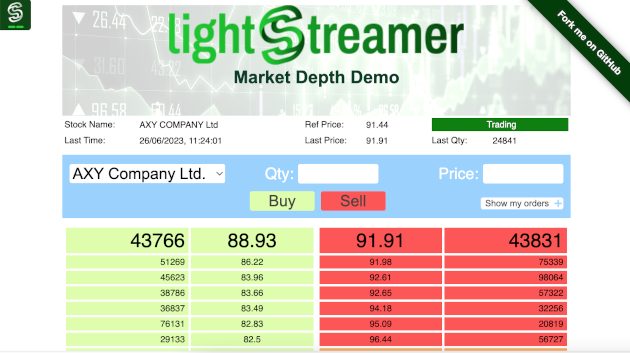

# Lightstreamer - Market Depth Demo - HTML Client

The *Market Depth Demo* is a very simple market depth application based on Lightstreamer for its real-time communication needs.<br>

This project includes a web client front-end for the demo.
The server-side part of this demo, the Metadata and Data Adapters, is covered in this project: [Lightstreamer - Market Depth Demo - Java Adapter](https://github.com/Lightstreamer/Lightstreamer-example-MarketDepth-adapter-java).

## Live Demo

[](http://demos.lightstreamer.com/MarketDepthDemo)

### [ View live demo](http://demos.lightstreamer.com/MarketDepthDemo)

## Details

Market depth is an electronic list of buy and sell orders, organized by price level and updated to reflect real-time market activity. 
Market depth data are also known as Level II, Depth Of Market (DOM), and the order book.<br>
<br>
Lightstreamer has semi-native support for market depth, which can be managed very easily via COMMAND mode subscriptions. Basically, the bid and ask lists for an instrument will be two items subscribed to in COMMAND mode.<br>
You will be able to add, update, and remove rows, where each row is identified by a key, which is the price. Lightstreamer will take care of aggregating updates to market depth in the most optimized way, based on bandwidth and frequency constraints.<br>
This way, you will be able to manage full market depths even on unreliable networks and also benefit from update resampling with conflation, if needed.<br>

The demo is based on an adapter that simulates the generation of random orders and any contracts in case of matching. Furthermore you can add orders at your convenience through the basic input form (only limited orders are allowed).<br>

The demo includes the following client-side functionalities:
* A [Subscription](https://lightstreamer.com/api/ls-web-client/latest/Subscription.html) containing 1 item, subscribed to in `MERGE` mode feeding a [StaticGrid](https://lightstreamer.com/api/ls-web-client/latest/StaticGrid.html) (showing summary data for the stock).
* Two [Subscription](https://lightstreamer.com/api/ls-web-client/latest/Subscription.html)s containing 1 item each, subscribed to in `COMMAND` mode feeding two [DynaGrid](https://lightstreamer.com/api/ls-web-client/latest/DynaGrid.html)s (showing the bid and ask lists).
* The orders are sent to the adapter through the Lightstreamer Server using the [LightstreamerClient.sendMessage](https://lightstreamer.com/api/ls-web-client/latest/LightstreamerClient.html#sendMessage) utility.

## Install

If you want to install a version of this demo pointing to your local Lightstreamer Server, follow these steps:
* As prerequisite, the [Lightstreamer - Market Depth Demo - Java Adapter](https://github.com/Lightstreamer/Lightstreamer-example-MarketDepth-adapter-java) has to be deployed on your local Lightstreamer Server instance. Please check out that project and follow the installation instructions provided with it.
* Download this project.
* Get the `lightstreamer.min.js` file from [npm](https://www.npmjs.com/package/lightstreamer-client-web) or [unpkg](https://unpkg.com/lightstreamer-client-web/lightstreamer.min.js) and put it in the `src/js` folder.
  Alternatively, you can generate a customized lightstreamer.min.js library containing only the classes you actually use;
  see the build instructions on the [GitHub page](https://github.com/Lightstreamer/Lightstreamer-lib-client-javascript#building).
  In that case, be sure to include the LightstreamerClient, Subscription, StaticGrid, DynaGrid, and StatusWidget modules.
* Get the `require.js` file form [requirejs.org](http://requirejs.org/docs/download.html) and put it in the `src/js` folder.
* Deploy this demo on the Lightstreamer Server (used as Web server) or in any external Web Server. In the former case, please create the folders `<LS_HOME>/pages/MarketDepthDemo` and copy here the contents of the `/src` folder of this project.
The client demo configuration assumes that Lightstreamer Server, Lightstreamer Adapters, and this client are launched on the same machine. If you need to target a different Lightstreamer server, please search in `js/lsClient.js` this line:<BR/> 
```
var lsClient = new LightstreamerClient(protocolToUse+"//localhost:"+portToUse,"MARKETDEPTH");
```
and change it accordingly.
* Open your browser and point it to: [http://localhost:8080/MarketDepthDemo/](http://localhost:8080/MarketDepthDemo/)

## See Also

### Lightstreamer Adapters Needed by This Client

* [Lightstreamer - Basic Market Depth Demo - Java Adapter](https://github.com/Lightstreamer/Lightstreamer-example-MarketDepth-adapter-java)

## Lightstreamer Compatibility Notes

* Compatible with Lightstreamer JavaScript Client library version 6.2 or newer (installation instructions for version 8.0 or newer).
